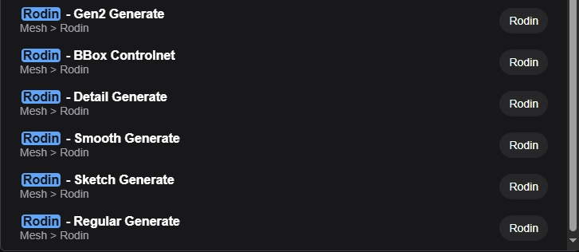
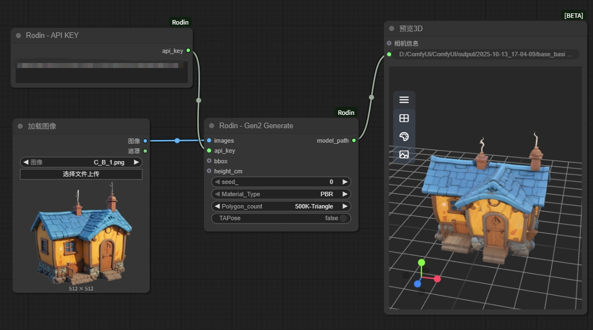
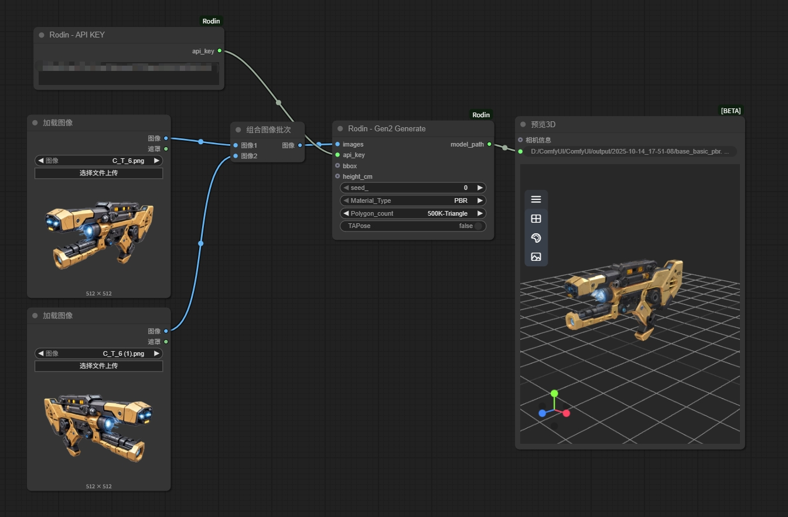
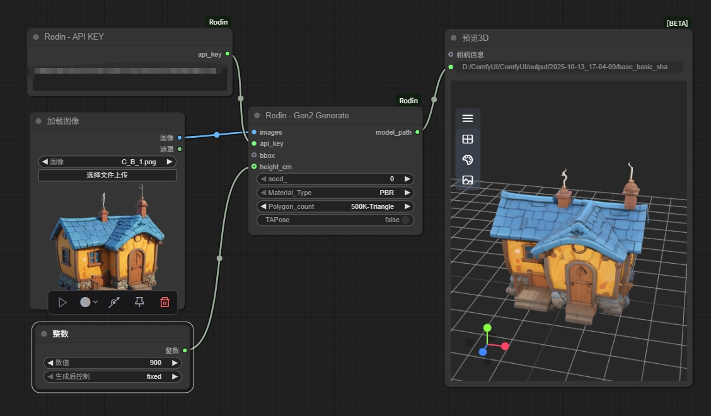

# ComfyUI-Rodin

**Comfyui-rodin** is a 3D generation extension based on [Rodin](https://hyper3d.ai/)-API. It provides many of the functionality nodes currently available in RodinAPI, such as Imgae-to-3D, Text-to-3D, Multiple Images-to-3D, etc. In addition, the extension provides a 3D preview node for Comfyui.

## Generate Rodin Models via ComfyUI Custom Node​

This ​​ComfyUI custom node​​ integrates with the Hyper3D API to generate 3D assets using Rodin. Get more information about 'How to use Rodin API' and 'How to get Rodin API KEY' from [Rodin API document](https://developer.hyper3d.ai/)

## Installation

1. **Can be installed directly from [ComfyUI-Rodin](https://github.com/DeemosTech/ComfyUI-Rodin.git)**

    Clone the repository:
    `git clone https://github.com/DeemosTech/ComfyUI-Rodin.git`
to your ComfyUI `custom_nodes` directory.

2. **Can be installed from ComfyUI-Manager**

## Update

1. Navigate to the cloned repo e.g. `custom_nodes/ComfyUI-Rodin`
2. `git pull`

## Features

- **Rodin Nodes Overview**
    - 
    
    This extension provides several utility nodes for Rodin generation and Controlnet use.

- **The Simplest way to use**
    - 

    Get your API key from [Rodin api-dashboard](https://hyper3d.ai/api-dashboard) and fill it into the <strong>"Rodin - API KEY"</strong> node. 
    
    All the Rodin generation nodes need to be linked with <strong>"Rodin - API KEY"</strong>.

- **Multi-view Rodin Generate**
    - 

- **How to use Boundbox ControlNet**
    - 

- **How to set Model height (in cm)**
    - 

 Obsolete node​s 

- **Rodin - Image to 3D**
    - Single image to 3D Mesh with Textures(PBR/Shaded)
    - A successful run will download the 3D model to `ComfyUI/output` directory.
    - 
    
    The **image** and **api_key** must be supplied, and other options can be adjusted. Refer to the [RodinAPI documentation](https://developer.hyper3d.ai/api-specification/overview) for parameter information.

- **Rodin - Text to 3D**
    - Prompt text to 3D Mesh with Textures(PBR/Shaded)
    - A successful run will download the 3D model to `ComfyUI/output` directory.
    - 
    
    The **Prompt** and **api_key** must be supplied, and other options can be adjusted. Refer to the [RodinAPI documentation](https://developer.hyper3d.ai/api-specification/overview) for parameter information.

- **Rodin - Multiple Images to 3D**
    - Multiple Images to 3D Mesh with Textures(PBR/Shaded)
    - A successful run will download the 3D model to `ComfyUI/output` directory.
    - Multiple images can be different views of the same object or different objects. At least one image should be supplied.
    - 
    
    The **images(At least one)** and **api_key** must be supplied, and other options can be adjusted. Refer to the [RodinAPI documentation](https://developer.hyper3d.ai/api-specification/overview) for parameter information.

- **Rodin - Preview 3D Mesh**
    - 3D Model preview node with support for multiple formats of PBR and Shaded rendering.
    - The currently supported model types are: `obj`, `glb`, `fbx`, `stl`.
    - The rendering mode can be switched.
    - 

